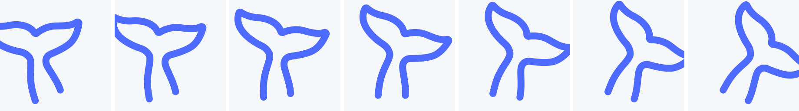
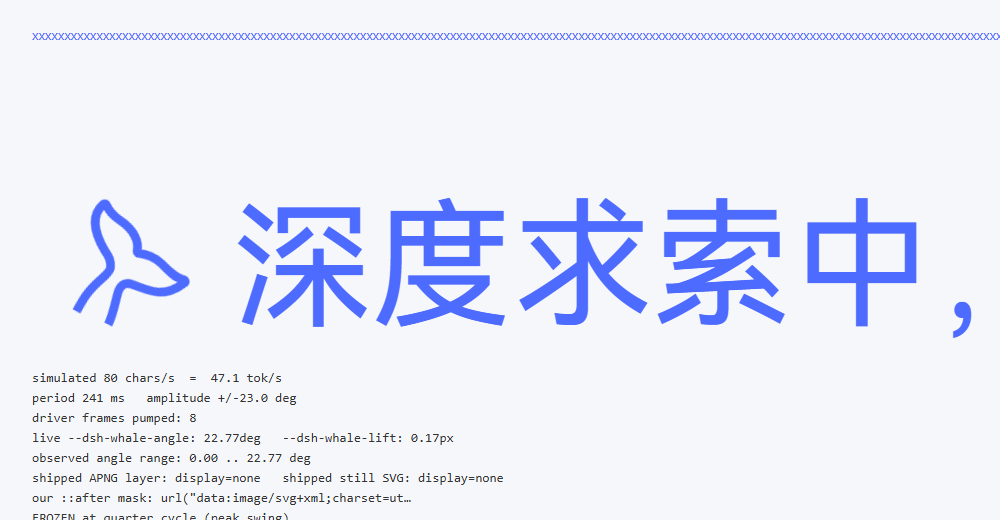

# dsh-whale-sway

[](https://github.com/asdnmy123/dsh-whale-sway/actions/workflows/ci.yml)
[](LICENSE)
[](#)

> **让 DSH「深度求索中」状态行的鲸尾真正摆起来** —— 摆幅更大，摆动速度跟随实时 tok/s。
> A token-rate-driven whale-tail sway for the DeepSeek Harness running indicator.

DSH 运行时状态行（`深度求索中，用时 N 秒 ···`）左侧那枚 DeepSeek 鲸尾图标，原版是**帧动画烘焙在 APNG 里**的：摆动幅度小、节奏固定，而且浏览器播放 APNG 的速率**用 CSS 改不了**。

这个插件只接管它的**运动**：

- **幅度更大**：±15°（空闲）～ ±23°（高速），原版只有几度。
- **速率跟随实时 tok/s**：模型吐字越快，尾巴摆得越快；等待工具调用时自动回到慢悠悠的空闲摆动。

图形本身**一点没改**——同一条 `REST_PATH`、同样的 `stroke-width: 1`、同样的 `currentColor`（`--dsw-alias-label-deep-diving` 蓝）、同样的位置与尺寸、同样保留无障碍状态节点。



---

## 为什么它和别的鲸鱼插件不一样

DSH 的鲸鱼插件已经不少：[dsh-whale-animation](https://github.com/LeemanCheung/dsh-whale-animation)、[dsh-whale-switch](https://github.com/bowen507/dsh-whale-switch)、[deepseek-whale-wallpaper](https://github.com/HeShen-1/deepseek-whale-wallpaper)、[dsh-pixelwhale](https://github.com/Lkrain821/dsh-pixelwhale)、[deepseek-whale-pet](https://github.com/alexcarterio/deepseek-whale-pet)、[dsh-whale-pet](https://github.com/rongzi5/dsh-whale-pet)……

它们绝大多数是**固定循环**：换素材、换帧序列、换时长，但动画本身和模型正在干什么无关。

这个插件做的是另一件事：**把摆动接进遥测**。

| | 常见做法 | dsh-whale-sway |
|---|---|---|
| 图形 | 换成自己的鲸鱼素材 | **保持原版** `REST_PATH`、描边与 `currentColor` |
| 动画来源 | 预置帧序列 / 固定 keyframes | `requestAnimationFrame` **相位积分** |
| 速率 | 固定时长 | **跟随实时 tok/s**（190 → 1500 ms） |
| 幅度 | 固定 | **随速率变宽**（±15° → ±23°） |
| 空闲 / 等工具 | 继续按固定节奏摆 | 自动回到慢速空闲摆动 |
| 体积 | 常带图片 / 音频素材 | 0 依赖、无构建、单个 client 文件 |
| 失效安全 | — | 不支持 mask / 减少动效 / 强制颜色 → 原版渲染原样保留 |

---

## 实现方式（为什么这么做）

### 1. 为什么不用 CSS keyframes 调速度

原版动画是 `span.runningWhaleAnimated` 用 APNG 当 CSS `mask`。APNG 的帧率由浏览器决定，**没有**任何 CSS 属性能缩放它；`animation-duration` 对它无效。

而且就算改用 keyframes，`animation-duration` 一变就会**重置相位**——尾巴会突然跳一下。

所以这里：隐藏原版 mask 与静态 SVG，用同一个路径重画一个 `::after` 伪元素，然后用 `requestAnimationFrame` **积分相位**：

```
phase += dt / period(rate)
angle  = amplitude(rate) * sin(2π * phase)
```

速度变化是连续的加速/减速，永远不会跳相位。

### 2. 速率从哪里来

客户端插件 API 没有暴露 token 计数：客户端事件目录只有 4 个（`connection/reset`、`locale/change`、`slots/changed`、`theme/change`），没有任何模型流事件；`ctx.sessions.binding(id)` 虽然能拿到 `AssistantLiveChunkEvent`，但需要一个客户端插件刻意拿不到的 session id。

所以速率按**用户实际感知**的方式测量：会话滚动容器每秒新增的字符数 ÷ 每 token 字符数（`charsPerToken`，默认 1.7，贴合中文输出）。

它和真实 tok/s 单调相关，且完全自包含——不依赖任何内部 API，shell 升级也不会失效。

### 3. 安全性设计

| 场景 | 行为 |
|---|---|
| 浏览器不支持 CSS `mask` | `@supports` 门控 → 原版渲染完全不动 |
| 用户开了「减少动态效果」 | `@media (prefers-reduced-motion: no-preference)` 门控 + JS 不启动 |
| 强制颜色模式 | 与官方实现一致地让位 |
| 插件抛异常 | 全部包在 try/catch 里，失败就保持原样，绝不弄坏对话流 |
| 禁用插件 | effect 清理样式表与 CSS 变量，窗口恢复原状 |

不渲染 React、不注册 Slot、不注册 Service——只注入一张样式表和两个 CSS 自定义属性（写在 `<html>` 上）。

---

## 速度 / 幅度映射

| tok/s | 周期 | 半幅 |
|---|---|---|
| 0（空闲、等工具） | 1500 ms | ±15° |
| 9 | 750 ms | ±16.6° |
| 20 | 466 ms | ±18.6° |
| 45 及以上 | 190 ms | ±23° |

周期公式：`clamp(1500 / (1 + rate / 9), 190, 1500)` ms
幅度公式：`15 + 8 * min(1, rate / 45)` 度，再加上 `sin(2*phase)` 的亚像素纵向点头（0.6px）。

---

## 调参

全部参数集中在 `client.js` 顶部的 `TUNING`：

| 字段 | 含义 | 默认 |
|---|---|---|
| `amplitudeDeg` | 空闲时的摆动半幅（度） | `15` |
| `amplitudeGainDeg` | 高速时额外增加的半幅 | `8` |
| `ampFullRate` | 达到满幅所需的 tok/s | `45` |
| `minPeriodMs` | 最快整周期 | `190` |
| `maxPeriodMs` | 最慢整周期（空闲） | `1500` |
| `rateRef` | 使周期减半的 tok/s | `9` |
| `maxRate` | 速率上限（防止一次大重绘打满） | `160` |
| `charsPerToken` | 每 token 字符数（中文 1.7，英文可调 4） | `1.7` |
| `sampleMs` | 采样窗口 | `200` |
| `smooth` | EMA 平滑系数 | `0.4` |
| `liftPx` | 纵向点头半幅，`0` 关闭 | `0.6` |
| `pivot` | 旋转轴心（尾柄根部） | `43% 86%` |

改完刷新页面即可（profile 的 `patchReload: live` 只影响 Host 侧；客户端模块每次加载页面重新取）。

**只想让摆幅更大 / 更小？** 只动 `amplitudeDeg` 与 `amplitudeGainDeg`。
**只想让它一直很快？** 把 `minPeriodMs` 和 `maxPeriodMs` 设成同一个值。

---

## 安装 / 卸载

```powershell
# 从 npm 安装（不写 --profile 就用当前活动 profile）
dsh plugin --profile <profile> add dsh-whale-sway

# 本地开发：link 本目录，改代码即时生效
dsh plugin --profile <profile> add link:<本仓库的绝对路径>

# 卸载
dsh plugin --profile <profile> remove dsh-whale-sway
```

也可以在 **Web UI → 设置 → 插件** 里安装与卸载。

安装后**刷新页面**；若当前 DSH 版本的客户端模块表在启动时构建，则重启 DSH。

> `link:` 指向的是**目录路径**。如果之后重命名了仓库目录，需要重新执行一次 `add link:<新路径>`。

---

## 验证

```powershell
# 离线测试：两个半的加载契约、速率映射、速率估计、样式生成、apply/dispose 生命周期
node tools/test-motion.mjs

# 把图标真实几何渲染成 PNG（零依赖光栅化器），并预览摆动范围
node tools/render-whale.mjs                                  # 静态形状
node tools/render-whale.mjs --pivot 6.88 13.76 --amp 23 --frames 7 --out preview/sway-final.png
```

`tools/render-whale.mjs` 是自己写的 SVG 路径光栅化器 + 手写 PNG 编码器（只用 `node:zlib`），
用来在**不启动浏览器**的前提下确认轴心位置和摆动观感。

### 真实浏览器引擎里的端到端验证

`tools/preview.html` 复刻了原版状态行的 DOM（含 `contain:strict`、`overflow:hidden`、原版 APNG 占位层与静态 SVG），
加载**真实的 `client.js`**，用模拟字符流喂真实的速率计，再用受控时钟泵帧把相位精确推到波峰后冻结截图：

```powershell
$edge = "C:\Program Files (x86)\Microsoft\Edge\Application\msedge.exe"
& $edge --headless=new --disable-gpu --hide-scrollbars --window-size=1000,520 `
  --virtual-time-budget=3000 --user-data-dir=.edge-tmp `
  --screenshot="preview/engine-fast.png" `
  "file:///<本仓库绝对路径>/tools/preview.html?cps=80"
```

| 截图 | 模拟速率 | 周期 | 摆幅 | 截图瞬时角度 | 原版层 |
|---|---|---|---|---|---|
|  | 47.1 tok/s | 241 ms | ±23.0° | 22.77° | `display:none` |
|  | 7.1 tok/s | 841 ms | ±16.3° | 15.85° | `display:none` |

截图里的读数取自页面自身：`--dsh-whale-angle` 由驱动循环实时写入、原版 APNG 层与原版静态 SVG 都已被隐藏、
我们的 `::after` mask 已生效——这是真实 Chromium 引擎渲染的结果，不是示意图。

---

## 已知边界

- 速率是**字符率折算的 tok/s**，不是精确 token 计数（原因见上）。若以后 DSH 暴露了流事件或 token 计数，`createRateMeter` 可以整体替换成真实数据源，映射公式不用动。
- 多个会话同时运行时共享同一相位（变量写在 `<html>` 上）。这在实际使用里看不出来，且让多标签页保持一致。
- 全幅摆动时尾鳍尖端会超出图标盒约 1.5px，因此覆盖了 `contain: none` + `overflow: visible` 让它可以自然地探出去（原版 `contain: strict` + `overflow: hidden` 会把尖端切平）。
